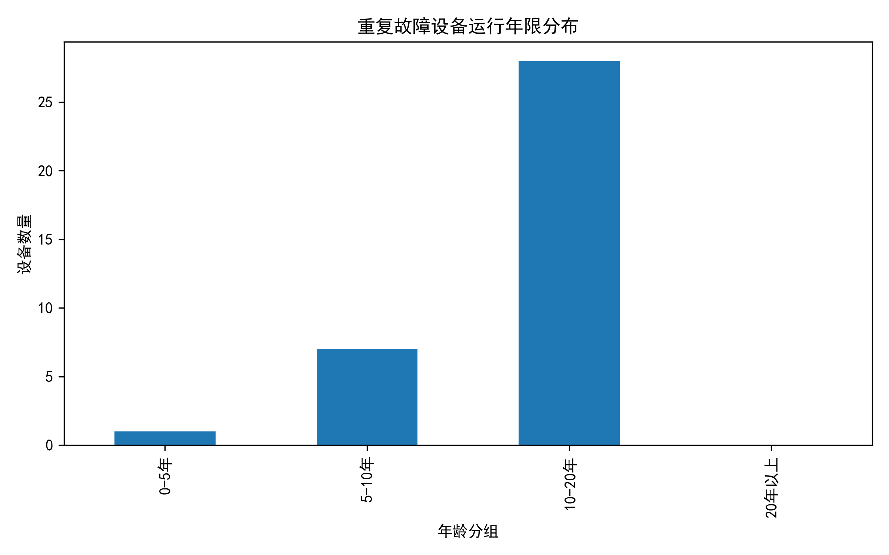
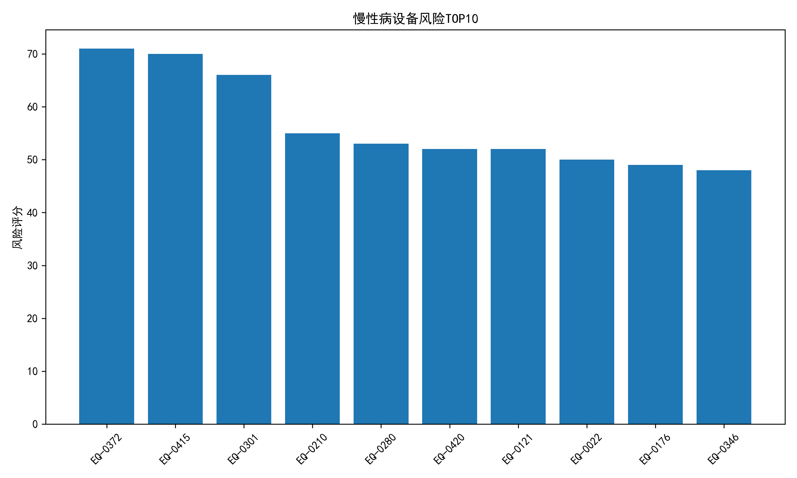

# 故障规律分析报告

## 1. 分析背景

为识别电力设备长期运行过程中的重复故障风险，降低设备非计划停运概率，本阶段基于故障工单、设备台账以及运行参数数据，对设备重复故障规律及慢性病设备特征进行分析。

本分析主要围绕以下内容展开：

1. 识别90天内重复发生故障的设备；
2. 分析重复故障设备在设备类型、运行年限、电压等级等方面的共性特征；
3. 结合运行参数分析设备潜在运行风险；
4. 建立慢性病设备风险评价方法，筛选重点关注设备。

---

# 2. 数据说明

本次分析数据来源：

| 数据表 | 用途 |
|----|----|
| 故障工单 | 提取故障发生时间、故障次数、严重等级等信息 |
| 设备台账 | 获取设备类型、电压等级、投运年限等基础信息 |
| 运行参数 | 分析设备负荷率、温度、绝缘状态等运行特征 |

分析对象：

- 重复故障设备数量：36台

重复故障定义：

> 同一设备连续两次故障发生时间间隔小于等于90天，则认为存在重复故障。

---

# 3. 重复故障总体分析

## 3.1 重复故障设备数量分析

共识别出：

- 重复故障设备数量：36台

设备平均：

- 历史故障次数：2.92次/台
- 平均重复故障率：38.98%

说明部分设备存在故障重复发生现象，需要进一步开展原因分析。

---

# 4. 重复故障设备特征分析

## 4.1 不同设备类型分布

重复故障设备类型统计如下：

|设备类型|数量|
|-|-:|
|断路器|14|
|电容器组|7|
|避雷器|6|
|电力变压器|5|
|隔离开关|2|
|GIS组合电器|2|

分析结果表明：

断路器为重复故障设备数量最多的设备类型，占重复故障设备主要比例。

可能原因包括：

- 开断操作频繁；
- 机械结构长期动作磨损；
- 操作机构及辅助回路容易出现异常。

---

## 4.2 电压等级分布

|电压等级|设备数量|
|-|-:|
|35kV|13|
|110kV|11|
|220kV|8|
|10kV|4|

分析发现：

35kV及110kV设备重复故障数量较高。

可能原因：

- 中低压设备数量较多；
- 投运时间较长；
- 运维关注程度低于高电压等级核心设备。

---

## 4.3 运行年限分析

重复故障设备运行年限分布：

|运行年限|数量|
|-|-:|
|10-20年|28|
|5-10年|7|
|0-5年|1|

结果显示：

超过77%的重复故障设备运行时间集中在10~20年。

说明设备运行年限增长后：

- 元件老化程度增加；
- 机械性能下降；
- 绝缘性能逐渐降低；

是造成重复故障的重要因素。

---

# 5. 故障严重等级分析

重复故障设备故障等级统计：

|严重等级|数量|
|-|-:|
|一般|20|
|严重|10|
|轻微|5|
|紧急|1|

分析结果：

大部分重复故障属于一般或严重故障。

虽然紧急故障数量较少，但其对电网安全影响最大，应优先处理。

---

# 6. 运行状态分析

结合运行参数，对重复故障设备运行状态进行分析。

主要关注：

- 月平均负荷率
- 油温
- 绝缘电阻

分析发现：

部分重复故障设备存在：

1. 负荷率偏高；
2. 运行温度升高；
3. 绝缘水平下降。

说明运行状态异常可能提前反映设备健康水平下降。

---

# 7. 慢性病设备风险评价

## 7.1 风险评价方法

建立综合风险评分模型：

    \[
    风险评分=
    重复故障风险
    +
    运行年限风险
    +
    故障严重度风险
    \]

其中：

|指标|权重|
|-|-:|
|重复故障风险|40分|
|年龄风险|20分|
|故障严重度|20分|

根据评分结果划分设备风险等级。

---

# 8. 风险设备分析结果

风险等级分布：

|风险等级|数量|
|-|-:|
|关注|19|
|预警|13|
|高风险|3|
|正常|1|

分析结果：

36台重复故障设备中：

- 高风险设备3台；
- 预警设备13台。

说明约44%的重复故障设备已经进入需要重点关注阶段。

---

# 9. 高风险设备清单

风险最高的设备如下：

|设备编号|设备类型|故障次数|重复故障次数|风险评分|风险等级|
|-|-|-:|-:|-:|-|
|EQ-0372|断路器|4|2|71|高风险|
|EQ-0415|断路器|4|2|70|高风险|
|EQ-0301|断路器|4|2|66|高风险|

分析：

三个最高风险设备均为断路器。

共同特点：

- 故障次数较高；
- 均存在90天内重复故障；
- 运行年限超过10年。

说明断路器机械结构可靠性下降可能是当前主要薄弱环节。

---

# 10. 主要分析结论

## （1）重复故障主要集中于老旧设备

大部分重复故障设备运行时间超过10年。

设备老化是影响可靠性的主要因素之一。

---

## （2）断路器是重点风险设备类型

断路器重复故障数量最高。

后续应重点关注：

- 操作机构状态；
- 分合闸性能；
- 二次回路可靠性。

---

## （3）重复故障具有明显累积效应

部分设备出现：

故障 → 修复 → 短期再次故障

现象。

说明部分故障未完全消除根因，需要开展深层次原因分析。

---

## （4）运行状态参数可作为预警依据

负荷率、温度以及绝缘参数变化能够反映设备健康状态变化趋势。

---

# 11. 运维优化建议

## 11.1 高风险设备

针对风险等级：

> 高风险

建议：

1. 开展专项检修；
2. 检查关键机械部件；
3. 评估设备继续运行寿命；
4. 必要时制定更换计划。

---

## 11.2 预警设备

建议：

1. 提高巡检频率；
2. 加强运行参数监测；
3. 建立设备状态趋势跟踪。

---

## 11.3 老旧设备管理

针对10年以上设备：

建议：

- 建立重点设备档案；
- 增加状态检测项目；
- 提前准备备品备件。

---

# 12. 后续分析方向

下一阶段将进一步结合：

- 巡检记录；
- 检修计划；
- 备品备件数据；

开展：

1. 运维效率评价；
2. 检修策略优化；
3. 设备健康综合评价模型构建。

---

# 附录：相关分析图表

|图表|路径|
|-|-|
|重复故障设备类型分布|results/week2/figures/recurring_fault/repeated_fault_equipment_type.png|
|重复故障设备年龄分布|results/week2/figures/recurring_fault/repeated_fault_device_age.png|
|慢性病设备风险TOP10|results/week2/figures/recurring_fault/chronic_device_risk.png|

